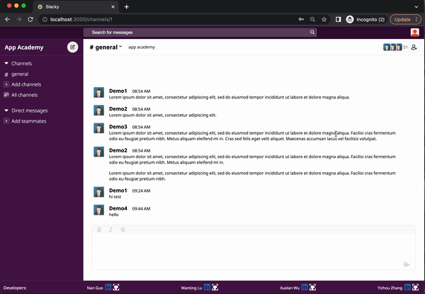

# Slacky

Live site here: https://slack-clone-2k4m.onrender.com

Slacky is a clone of slack.com. The site allows registered users to communicate with others through a channel or private messages. A registered user can create channels of their particular topic, add members, modify the created channel and delete as needed. Members can also choose to make modifications or leave the channel. Members of a channel can send messages and see everyone else messages in the channel. The instant direct message are private and user-to-user specific. When a sender messages the intended receiver, the receiver will get the message without having to refresh it's own page. On top of channel, channel messages and direct messages, users can also search their all messages available to them from search bar.

## TechStack

### Languages


### Frameworks and Libraries


### Database:


### Hosting:


# Getting started

1. Clone this repository (only this branch)

2. Install dependencies

   ```bash
   pipenv install -r requirements.txt
   ```

3. Create a **.env** file based on the example with proper settings for your
   development environment

4. Make sure the SQLite3 database connection URL is in the **.env** file

5. This starter organizes all tables inside the `flask_schema` schema, defined
   by the `SCHEMA` environment variable. Replace the value for
   `SCHEMA` with a unique name, **making sure you use the snake_case
   convention**.

6. Get into your pipenv, migrate your database, seed your database, and run your Flask app

   ```bash
   pipenv shell
   ```

   ```bash
   flask db upgrade
   ```

   ```bash
   flask seed all
   ```

   ```bash
   flask run
   ```

7. To run the React App in development, checkout the [README](./react-app/README.md) inside the `react-app` directory.

# Features

## Home Page

The home page provides a user sign in and sign up options. By clicking on the buttons, a user will be taken to the sign in or sign up pages.

### Sign In


### Sign Up


Upon a successful sign in or sign up, a user will be taken to the logged in landing page. The app automatically sign the user up for the 'general' channel upon sign in.

### After Log In

On the top of the page, users can search for messages and click on the profile icon to check their own status and logout.

### Search Messages



### Logout

## Browse Channels

### Channel Sidebar

Users can see a list of their joined channels on the left hand sidebar.


### All Channels

Users can also see a list of all available channels by clicking on the 'All channels' button on the sidebar.


### Add A Channel

Users can add a channel by clicking on the 'Add channels' button.


### Channel Banner

To see the details of a channel, users can click on the name of the channel in the channel banner on the right. The banner also includes summary of channel description and number of members.


### Channel Details

Under the channel details page, a member can edit the channel by clicking on the 'Edit channel' button. A member can also leave the channel by clicking on the 'Leave channel' button. An organizer of the channel can choose to delete the channel by clicking on the 'Delete channel' button. Upon leaving or deleting a channel, the user will be redirected to the 'general' channel page.

### Edit Channel


On the channel member tab, a user can see all members of the channel and all more members by clicking on the 'Add people' button.

### Channel Details - Members

A user can search for usernames and click on the person they'd like to add.

### Add Members


## Direct Messages

Users can search for a username and start a direct message to the member.

### Search Users


### New Messages


Receivers of the message will see the name of senders showing up on their page once a message is sent from the sender.

### Direct Message Index


## ChannelMessages

### Read All Meesages

Message list will appear ordered by date and time. The newest messages will appear at the bottom of the feed while the oldest will appear at top.


### Send Messages

Users can send new messages in channels they are subscribed to.


### Edit/Delete Messages

Edit button and delete button will appear when message authors stops or hover the mouse pointer above the message feed. Message authors can edit the message directly in the message feed.


## Developers

* Nan Guo
  * https://github.com/Alicenanguo
  * https://www.linkedin.com/in/nan-guo-a7762325a/

* Wanting Lu
  * https://github.com/Winnie-1201
  * https://www.linkedin.com/in/wantinglu/
  
* Xuelan Wu
  * https://www.linkedin.com/in/xuelan-wu-ba354a1b0/
  * https://github.com/xuelanwu
  
* Yizhou Zhang
  * https://www.linkedin.com/in/yizhoucatherinezhang/
  * https://github.com/OneBoatFly


